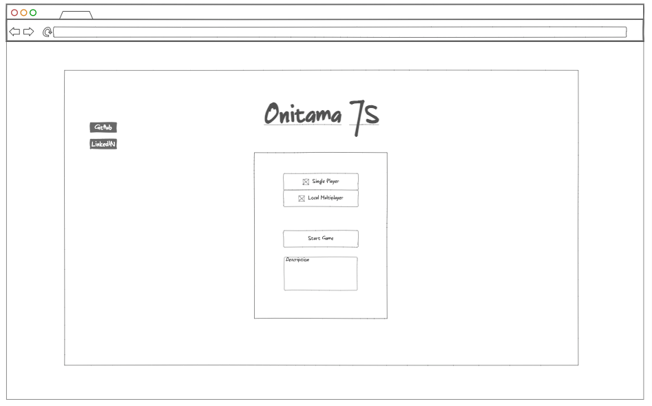
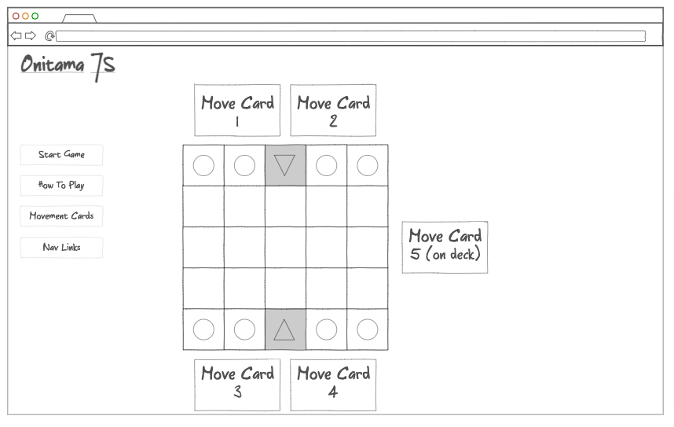
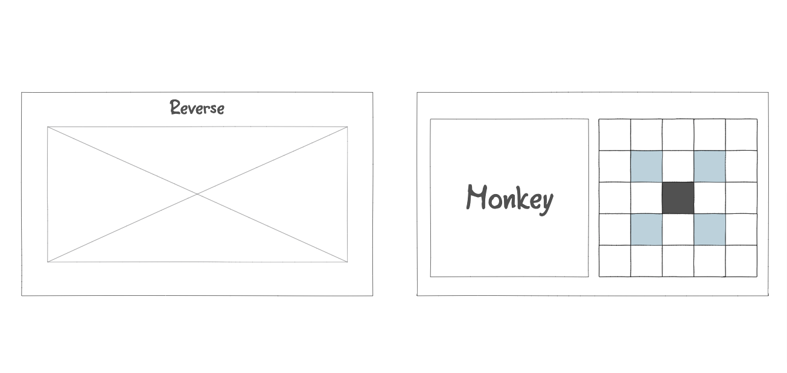

# Onitama

## Background

Onitama is a strategy board game for two players. The player moves their pawns on a 5x5 grid using a set of five movement cards. The player may use a card to move any of their pawns in the pattern depicted, however, this card is then exchanged with a card outside the board. This allows both players rotating access to all 5 movement cards in play!

The game is easy to learn thanks to its unique visual design.  It also allows for a high level of strategic gameplay with it's dynamic moveset. 

---

## Functionality

In Onitama, users will be able to:
  - Generate a random combination of (5) movement cards from the possible (16+)
  - Select and move their pawns on the 5x5 grid
  - Capture pawns (or be captured) as depicted in the movement cards
  - Play against a CPU player or screen-shared player

In addition, this project will include:
  - How to play instructions (interactive visual and text)
  - Production README

---

## Wireframes

### Welcome Layout
- Nav links include the project GitHub repo and LinkedIN
- Single Player or Multiplayer selection with radio
- Start Game not-interactive until player selection
- Description includes brief overview of the game and project scope  
 
---
 

### Board Layout
- Start Game will be dynamic to show:
    - "Reshuffle" at start to reselct random move cards
    - "End Game" to stop play
    - "Start Game" if play has been stopped
- How To Play will bring up a visual and text based instructions
    - GIFs or walkthrough possible?
- Movement Cards will display all of the (16) possible move cards
- Nav Links to the project GitHub repo and LinkedIN
- Pawns (circle and triangle): select/deselect (*click*) pawn and *mouseover* their movement cards to highlight possible moves on the grid
- Move Cards: select/deselct (*click*) movement card to lock their possible moves and select (click) among the hightlighted spaces to move
 
 
---
  

### Card Layout
- One of (16+) movement cards
- Left box will display card name and possible graphic
- Right box shows possible movement pattern
  - Dark box represents current position
  - Colored boxes represent possible movement by pawn
- Reverse will aid in card swap "sleight of hand" 

[Wireframes](https://ninjamock.com/s/F41V1Jx)

---

## Technologies, Libraries, APIs
This project will be implemented with the following technologies:
- `Canvas API` to render the game board
- `Webpack` to bundle the source JS code
- `npm` to manage project dependencies
- `animate.css` to assist in card flip and movement animations [link](https://animate.style/)

---

## Implementation Timeline

**Friday, Saturday, Sunday** 
- Setup webpack and file structure
- Create `Board`, `Piece`, `Card`, and `Game` classes
- Render grid with initial layout (CSS/canvas)
- Write and mock-up tutorial 

**Monday** 
- `Card` and `Piece` underlying logic
- All movement card function on piece position

**Tuesday**
- `Game` and any remaining `Board` logic for win conditions and start/end game states
- User mouse controls to the pieces, cards, and board

**Wednesday** 
- Formatting and animation styling
- If time allows, add welcome functionality, otherwise build into the single page nav 

**Thursday**
- Deploy to GitHub Pages with production README

----

## Bonus
- Add additional movement cards from print game expansions
- Add additional piece type and game modes from print game expansions
- Add Multiplayer functionality (remote)
- Add AI difficulty levels
- Add card, piece capture, and game state animations
- Add card movement quotes on play

